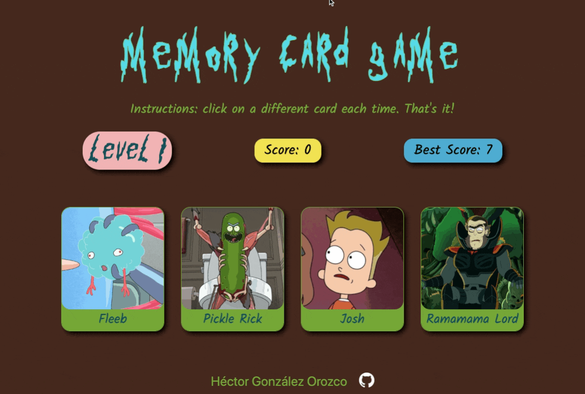

# Memory Card Game

Memory card game using Rick and Morty characters. The rules are simple: click twice on a card and it's game over. The number of cards keeps increasing on each level.

I made this game as practice with React hooks and using results from API calls asynchronously.

By [Héctor González Orozco](https://github.com/hectorgonzalezo)

## :computer: Built With

* [ReactJS](https://reactjs.org/)

## :ferris_wheel: Live Preview

[https://hectorgonzalezo.github.io/memory-card/](https://hectorgonzalezo.github.io/memory-card/)

## :rocket: Features

- Keeps current score and highest score so far in session.

-  Level system that creates a new set of cards with two extra every time the player guesses all of them.

- Shuffles cards after every click.

- After clicking twice on the same card, displays a modal that shows score reached and restart button.

## :construction: Installing

1. Clone the repository

`git clone https://github.com/hectorgonzalezo/memory-card`

2. Install dependencies

`npm install`

3. Start the development server

`npm start`

## :camera: Sneak Peek

## Acknowledgements

- Data from [The Rick and Morty API](https://rickandmortyapi.com/).
- Favicon by [icons8](https://icons8.com/).